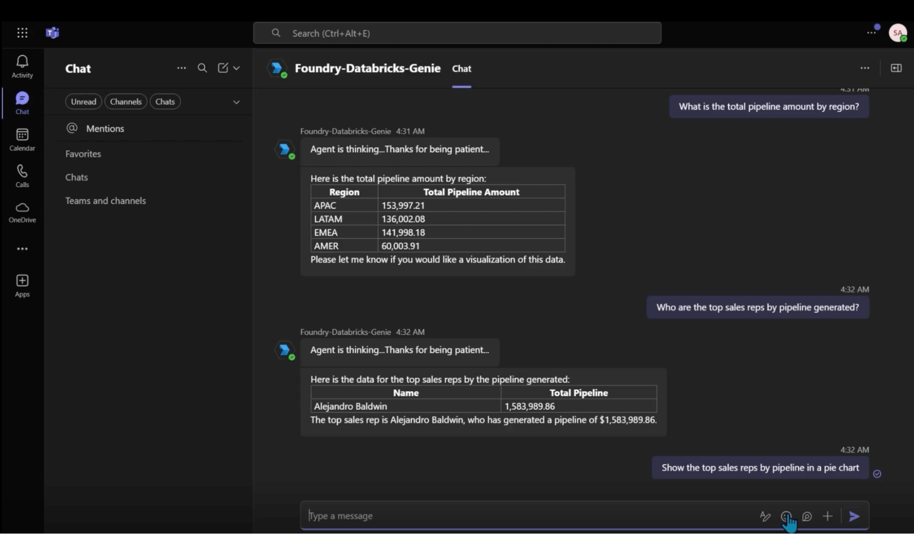

# ADB-Teams Sample App 

This project demonstrates a sample Teams app that communicates with Azure Databricks Genie space via OBO (on-behalf-of-flow; logged-in user's credentials) based on the Connection configured on Azure AI Foundry portal. It utilizes sample databset deployed on Databricks Genie, but can work with any dataset.

**Disclaimer**: Sample Teams app is mean't for learning purposes only and not mean't for production. Sample shows how one can use the app on local device (laptop) using devtunnel, but one needs to deploy the app on the cloud (see homework section towards the end).  One also needs to follow standard engg best practices (security, availability, scalability) before going into production.

## Prerequisites
-   Access to Azure tenant/subscription & Teams Admin+Dev Center with appropriate roles 
-   Familiarity with Azure Databricks 
-   Devtunnel https://learn.microsoft.com/en-us/azure/developer/dev-tunnels/cli-commands
- Python 3.13+
- Azure Bot Service
- Teams App created and uploaded  on Teams Admin Center
- AI Foundry Hub & Project is created, Connection with Azure Databricks and LLM model (e.g. gpt-4o-mini or some other model) is deployed.

### Azure Databricks Sample Dataset and Genie

    Use this to create dataset and deploy Genie https://www.databricks.com/resources/demos/tutorials/aibi-sales-pipeline-overview?itm_data=demo_center

### Devtunnel Setup

-   Install devtunnel on Windows (Refer this https://learn.microsoft.com/en-us/azure/developer/dev-tunnels/get-started?tabs=windows for other OS)

    ```bash
        winget install Microsoft.devtunnel OR
        winget upgrade Microsoft.devtunnel
    ```

-   Create persistent devtunnel (active for 30 days only) & add port 3978

    ```bash
        devtunnel create my-tunnel -a
        devtunnel port create -p 3978 my-tunnel
        
        #Host the tunnel 

        devtunnel host my-tunnel
    ```

-   **Imp:** Grab the url shown by devtunnel.  It will be something like <https://dl5zst7j-3978.usw3.devtunnels.ms>
    
### Create Azure Bot and Configure App Registration

Please do the following

-   Create new Azure Bot service on Azure Portal: https://portal.azure.com/#create/Microsoft.AzureBot

    Provide Bot handle name, 
    Pick Single tenant as Type of App, 
    Select Data Residency as Global, 
    Change Pricing Tier to Free (for production you will need to change it)
    Creation: Type select Create new Microsoft App ID.  

    Visit the Azure Bot resource created.

    -   **Imp:** Click Configuration and grab **Bot ID (Microsoft Bot/Client/App ID)** and App **Tenant ID**

        Grab **devtunnel url** from the previous step. Don't plug-in angle brackets

    -   Change Messaging Endpoint as <dev-tunnel-url>/api/messages  e.g.<https://dl5zst7j-3978.usw3.devtunnels.ms>/api/messages 

    -   Channels: Select Microsoft Teams and make sure it's healthy

-   Go to App Registration: 
    
    https://portal.azure.com/#view/Microsoft_AAD_RegisteredApps/ApplicationsListBlade

    -   **Authentication:**

        - Click Add a Platform, pick Web and plug-in https://token.botframework.com/.auth/web/redirect in Redirect URL field. 
        
        - Make sure Access tokens and ID tokens checkboxes are selected. 

    -   **Certificates and Secrets:** 
        
        - **Imp** Create a new **Client secret** and store it securely. - It will go in the .env file (listed below)

    -   **Click API Permissions:** 
        
        - Click Add a Permission, select Microsoft Graph, click Delegated Permissions, Select openid and profile in OpenId Permissions, and Select User.Read in User. Click "Add persmissions" button.
        - Click Add a Permission, Click "APIs my organization uses", type AzureDatabricks (no spaces) and select the entry and ensure that user_impersonation is checked in Permissions dropdown and click "Add persmissions".
        - Click "Grant admin consent for Domain" button. 

        **Expose an API:**

        - Change App ID URI as api://botid-<Microsoft-Bot/App-ID> - **Jot down this App ID URI**

        - Add a Scope, type scope name as access_as_user, select Admins and Users and make sure State is enabled. **Imp Copy the Scope uri**

        - Add a Client Application and type the 2 entries - They represent the Teams desktop/mobile clients and the web client.
            1fec8e78-bce4-4aaf-ab1b-5451cc387264 
            5e3ce6c0-2b1f-4285-8d4b-75ee78787346

-   Go back to the Azure bot you created https://portal.azure.com/#create/Microsoft.AzureBot

    -   **Configuration:** 

        -   Click Add OAuth Connection Strings
        Give a **Connection name** (eg. MSFTAAD; store this and use it in the .env file), 
        Pick Azure Active Directory v2 as Service Provider 
        Client ID: Paste Microsoft App/Bot ID 
        Tenant Id: Paste App Tenant ID 
        Token Exchange URL:  Bot App URI (e.g. api://botid-836492-edef-4ca7-9e47-8ba491b8ef05)
        Scopes - Plug the Scope uri we captured earlier. (eg. api://botid-836492-edef-4ca7-9e47-8ba491b8ef05/access_as_user)

        -   Select newly created OAuth Connection and click Test Connection. It should show successful message, but if it doesn't you need to enter the correct values.


### Create Azure AI Foundry Project and ADB Connection

-   Visit int.ai.azure.com (or https://int.ai.azure.com), 
    
    -   Create new Project and grab **"Azure AI Foundry project endpoint"** - It needs to be used as **FOUNDRY_URL** in the .env file later

    -   Click Models and endpoints, and deploy Base Model (e.g. gpt-4o-mini) in the new project.  Keep **Model name** aside as it also needs to be plugged in the .env file later.

    -   Click **Management Center** hyperlink listed at the bottom of the left hand panel.

    -   Click Connected Resources and click New Connection.

        -   Scroll down and select Azure Databricks.

            As long as your Azure Databricks instance is deployed, you will see it and one needs to select Genie in the Connection Type drop-down. 

        -   Next select the appropripate Genie space from the Select Genie Space drop-down.

            Make sure that the authentiation dropdown is set to Microsoft Entra ID.
        Click Add Connection.

        -   Note down the **name of the Connection**; it will be in this format <adbworkspacename>+'genie'+<genie room id>. 

            **ADB_CONNECTION_NAME** variable in the .env file will need this connection name. 

### Create Azure Storage Acct and Blob Container

-   Create Azure Storage Acct and ensure the following

    - Anonymous blob access is enabled. Goal is to ensure that Teams app can render graphs/charts generated dynamically via the Code Interpreter tool. 

    - Go to Security + networking | Networking. Ensure that it is enabled for all public networks.Goal is to ensure that the Teams app can upload images from any IP to the container within the storage account. 

-   Create Container within the storage account. 
        
    -   Grab the **storage acct name** and  **container name** as you will use both in the .env file.

    -   **Imp:** Ensure that the EntraID user(s) using the Teams app have "Blob Storage Account Contributor" role on the container.  

### Configure .env variables in your Teams app project 

    Copy .env.TEMPLATE as .env and fill the values of all variables. (Dont use <> at all)

    AGENTAPPLICATION__USERAUTHORIZATION__HANDLERS__GRAPH__SETTINGS__AZUREBOTOAUTHCONNECTIONNAME=MSFTAAD
    AGENTAPPLICATION__USERAUTHORIZATION__HANDLERS__GRAPH__SETTINGS__OBOCONNECTIONNAME=SERVICE_CONNECTION

    CONNECTIONS__SERVICE_CONNECTION__SETTINGS__CLIENTID=<clientid captured above>
    CONNECTIONS__SERVICE_CONNECTION__SETTINGS__CLIENTSECRET=<clientsecret captured above>
    CONNECTIONS__SERVICE_CONNECTION__SETTINGS__TENANTID=<tenantid captured above>

    DATABRICKS_HOST=<url of Azure Databricks Host e.g. https://adb-47356201795426.6.azuredatabricks.net/>
    
    FOUNDRY_URL=<fill in the Azure AI Foundry project url>
    ADB_CONNECTION_NAME=<fill in the ADB Connection Name>
    MODEL_DEPLOYMENT_NAME=<gpt-4o-mini>

    STORAGE_ACCTNAME=
    STORAGE_CONTNAME=


### Install the libraries in the virtual environment

        Create virtual env and activate it. 
            python -m venv venv
        
        Activate python environment as follows

        On Windows
            .\venv\Scripts\activate

        On Mac/Linux
            source /.venv/bin/activate

        pip install -r requirements.txt
        
### Create Teams manifest app

-   Go to https://dev.teams.microsoft.com/ and do the following

    -   Click **New App**

        Basic Info: Fill-in the following manadatory fields 

        -   ShortName
            FullName
            Description
            LongDescription
            Dev/Company-Name 
            App URLs (privacy url, Terms of Use url) - They can be set to the devtunnel uri
            Application Client ID (same as Bot/Microsot-App ID), 
            Website URL (it can be same as tunnel url)  e.g. https://dl5zst7j-3978.usw3.devtunnels.ms (use your own) 

        -   **Domains:** Plug-in just the domain of the devtunnel (without https) captured above  e.g dl9zst2j-3978.usw3.devtunnels.ms  

        -   In App Features: Select Bot and plug in the Bot ID, and select all 3 scopes Personal, Team and GroupChat

        -   In Single Sign-on: Plugin the App ID URI as follows (e.g api://botid-<your-bot-id>) - Replace bot id with your own and don't use <> brackets

        -   In App Package Editor, fix any missing entries in manifest.json if needed and then click Download (it will download the zip file)

### Upload Teams app in Teams Admin Center

-   Go to https://admin.teams.microsoft.com/ to get familiar with the Teams Admin Center

    -   Click Teams | Manage Apps or https://admin.teams.microsoft.com/policies/manage-apps/ 
        
    -   Click **Actions | Upload New App** and select the App Manifest zip file (you downloaded to the local computer in the previous step).

## Accessing this sample app from Teams (browser)

-   Make sure devtunnel is hosting the app

        devtunnel host my-tunnel

-   In VS Code 
    
    Activate the virtual environment
    
        .\venv\Scripts\activate (Windows)
        OR
        source .venv/bin/activate (Mac/Linux)

    Run the app 
    
        python app.py

-   Access Teams via Browser https://teams.microsoft.com/v2/

    -   Click **Apps** on the left pane. Search for your app and click **Add**

    -   Now you can test the Teams app from the browser itself.  Here's the sample screenshot of 

-   Sample questions to try out against the Sales Pipeline dataset
    -   Show the top sales reps by pipeline in a pie chart
    -   Show the no of opportunities by stage in a graph
    -   Show me the total pipeline amount by region in a bar chart
    -   What is the total pipeline amount by region?
    -   What is the average size of active opportunities?
    -   How many opportunities are in each stage?
    -   What is the average number of days to close an opportunity?
    -   Who are the top sales reps by pipeline generated?
    -   What is the total annual revenue by account?
    -   How many opportunities were won or lost in the current fiscal year?
    -   What is the distribution of opportunities by industry?
    -   What is the total pipeline amount for a specific account?
    -   What is the average probability of closing an opportunity by region?

### Homework

-   Please explore the following to enhance your learning

    - Azure AI Agent is being dynamically created every single time. One can resuse an existing agent to reduce the execution time.

    - Figure out how to deploy the Python App on Azure App Service (Web App) or Azure Kubernetes Service or Azure Container Service. Bot Messaging EndPoint and Domains field in Teams manifest field would need to point to the url of the deployed app. Retest the Teams app again to ensure that the app still works.
    
    - Learn how to build the same app in different languages (C#, TypeScript) with M365 Agents Toolkit (Refer documentation as needed)

    - Follow the security and regional deployment best practices for production readiness.
