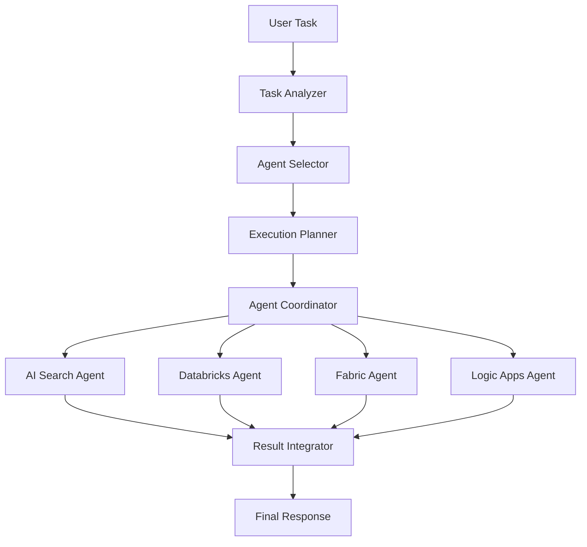

# Multi-Agent System with Semantic Kernel Integration

This directory contains a comprehensive multi-agent system built on Azure AI Agents and Semantic Kernel framework. The system demonstrates how to coordinate multiple specialized agents to handle complex business tasks.

## File Structure

### Individual Agent Files (Step 1)
- **`step1_azure_ai_agent_retrieval_ai_search.py`** - AI Search agent for information retrieval
- **`step1_azure_ai_agent_sk_databricks.py`** - Databricks agent for data analysis and ML
- **`step1_azure_ai_agent_sk_fabric.py`** - Microsoft Fabric agent for BI and data warehousing  
- **`step1_azure_ai_agent_sk_logic_app.py`** - Logic Apps agent for workflow automation

### Multi-Agent Integration Files
- **`step4_handoff.py`** - Basic handoff pattern between multiple agents
- **`step2_sk_multi_agent_handoff.py`** - **Main integrated multi-agent system** ⭐

## Key Features

### 🤖 Multi-Agent Coordination
- **Intelligent Task Analysis**: Automatically analyzes complex tasks and determines which agents are needed
- **Smart Agent Selection**: Uses keyword matching and scoring to select the most relevant agents
- **Sequential Execution**: Creates and executes optimal execution plans across multiple agents

### 🧠 Semantic Kernel Integration
- **Unified Agent Interface**: All agents use the Semantic Kernel framework for consistency
- **Streaming Responses**: Real-time streaming of agent responses with intermediate step handling
- **Thread Management**: Maintains separate conversation threads for each agent

### 🔄 Advanced Orchestration
- **Context Preservation**: Passes context between agents for coherent multi-step workflows
- **Error Handling**: Robust error handling with fallback to mock agents when needed
- **Resource Management**: Automatic cleanup of threads and resources

## Supported Agent Types

| Agent Type | Capabilities | Keywords |
|------------|-------------|----------|
| **AI Search** | Information retrieval, document search | 搜尋, 找到, 查詢, 檢索, 資訊, 資料 |
| **Databricks** | Data analysis, ML, ETL processing | 分析, 處理, ETL, 資料科學, 機器學習 |
| **Fabric** | BI reports, data warehousing | 報表, BI, 資料倉儲, OneLake, Power BI |
| **Logic Apps** | Workflow automation, notifications | 工作流程, 自動化, 通知, 郵件, 審核 |

## Usage Examples

### Basic Multi-Agent Task
```python
# Example: Complex business process
task = "搜尋豪華飯店資訊，分析客戶滿意度數據，產生BI報表，建立自動化回饋流程"

# System automatically:
# 1. Analyzes task requirements
# 2. Selects relevant agents (Search + Databricks + Fabric + Logic Apps)
# 3. Creates execution plan
# 4. Coordinates agent execution
# 5. Integrates results
```

### Agent Selection Logic
The system intelligently selects agents based on task content:
- **Search Agent**: For information retrieval and document search tasks
- **Databricks Agent**: For data analysis, machine learning, and ETL processes  
- **Fabric Agent**: For business intelligence reports and data warehousing
- **Logic Apps Agent**: For workflow automation and business process management

## Setup Requirements

### Environment Variables
```bash
# Required for all agents
PROJECT_ENDPOINT=<your-azure-ai-project-endpoint>
MODEL_DEPLOYMENT_NAME=<your-model-deployment-name>

# For specific integrations
AZURE_AI_CONNECTION_ID=<search-connection-id>
MY_AZURE_OPENAI_ENDPOINT=<openai-endpoint>
```

### Dependencies
```bash
pip install azure-ai-projects
pip install azure-ai-agents  
pip install azure-identity
pip install semantic-kernel
pip install python-dotenv
```

### Agent IDs Configuration
Before running, update the agent IDs in `step2_sk_multi_agent_handoff.py`:
```python
self.agent_ids = {
    "search": "your-actual-search-agent-id",
    "databricks": "your-actual-databricks-agent-id", 
    "fabric": "your-actual-fabric-agent-id",
    "logic_app": "your-actual-logic-app-agent-id",
}
```

## Running the System

### Individual Agents
```bash
# Test individual agents
python step1_azure_ai_agent_sk_databricks.py
python step1_azure_ai_agent_sk_fabric.py
python step1_azure_ai_agent_sk_logic_app.py
```

### Basic Handoff Example
```bash
python step4_handoff.py
```

### Full Multi-Agent System
```bash
python step2_sk_multi_agent_handoff.py
```

## System Architecture



## Execution Flow

1. **Task Analysis**: Parse complex user requirements
2. **Agent Selection**: Choose relevant agents based on task content
3. **Plan Creation**: Generate optimal execution sequence
4. **Agent Coordination**: Execute tasks across multiple agents
5. **Context Management**: Maintain state between agent calls
6. **Result Integration**: Combine outputs into coherent response
7. **Cleanup**: Proper resource management and thread cleanup

## Mock vs Real Agents

The system supports both:
- **Real Agents**: When proper agent IDs and credentials are configured
- **Mock Agents**: Fallback simulation when real agents are unavailable

This allows for:
- ✅ Development and testing without full infrastructure
- ✅ Graceful degradation when some agents are offline
- ✅ Easy demonstration of multi-agent concepts

## Error Handling

- **Agent Initialization Failures**: Falls back to mock agents
- **Execution Errors**: Captures and reports errors gracefully
- **Resource Cleanup**: Ensures proper cleanup even on failures
- **Timeout Handling**: Prevents hanging on unresponsive agents

## Contributing

When extending the system:
1. Add new agent types to `agent_capabilities` dictionary
2. Implement agent-specific task generation in `_generate_agent_task()`
3. Update the execution order logic in `_create_execution_plan()`
4. Add appropriate mock responses for testing

## Best Practices

- **Agent Design**: Keep agents focused on specific domains
- **Task Decomposition**: Break complex tasks into clear, actionable steps
- **Context Passing**: Use context dictionary to share information between agents
- **Error Recovery**: Always implement fallback mechanisms
- **Resource Management**: Properly cleanup threads and connections